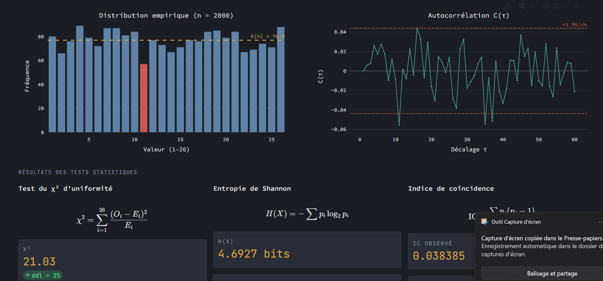

# Rapport de projet — Chiffrement Solitaire (Pontifex)

**Cours :** Cryptographie  
**Étudiant :** Yani Mohellebi  
**Date :** Avril 2026  
**Technologies :** Python 3.12 · Streamlit · ChromaDB · Gemini API · pytest

---

## Table des matières

1. [Introduction](#1-introduction)
2. [L'algorithme Solitaire](#2-lalgorithme-solitaire)
3. [Choix techniques](#3-choix-techniques)
4. [Implémentation](#4-implémentation)
5. [Visuels — génération des 54 cartes](#5-visuels--génération-des-54-cartes)
6. [Intégration IA](#6-intégration-ia)
7. [Sécurité](#7-sécurité)
8. [Tests](#8-tests)
9. [Réseau](#9-réseau)
10. [Conclusion](#10-conclusion)

---

## 1. Introduction

Le chiffrement **Solitaire** (aussi appelé *Pontifex*) a été conçu par Bruce Schneier en 1999, à la demande de l'auteur Neal Stephenson pour son roman *Cryptonomicon*. L'idée centrale est de disposer d'un algorithme de chiffrement par flux (*stream cipher*) qui peut être exécuté **sans ordinateur**, en utilisant uniquement un jeu standard de 54 cartes.

L'originalité de Solitaire par rapport aux algorithmes classiques (César, Vigenère) est qu'il ne repose pas sur un simple décalage ou une table fixe. L'état interne — l'ordre des 54 cartes — évolue à chaque lettre chiffrée, ce qui le rapproche des stream ciphers modernes comme RC4 ou ChaCha20.

Ce projet implémente Solitaire en Python avec une interface graphique complète, une démonstration pas-à-pas de chaque opération, un assistant IA cryptographique, et une analyse statistique des faiblesses connues de l'algorithme.

---

## 2. L'algorithme Solitaire

### 2.1 Représentation du paquet

Le paquet est modélisé comme une séquence ordonnée de 54 entiers :

| Valeurs | Famille |
|---------|---------|
| 1 – 13  | Trèfles (As → Roi) |
| 14 – 26 | Carreaux |
| 27 – 39 | Cœurs |
| 40 – 52 | Piques |
| 53      | Joker A (Joker Noir) |
| 54      | Joker B (Joker Rouge) |

Chaque carte a deux valeurs distinctes selon l'usage :
- **Valeur de chiffrement** (1–26) : utilisée pour le flux de clés. Les cartes 27–52 sont ramenées dans 1–26 par soustraction de 26. Les jokers retournent 53 (ignorés).
- **Valeur Bridge** (1–53) : utilisée pour les opérations de coupe. Les deux jokers valent tous les deux 53.

### 2.2 Le cycle de génération du flux de clés

Un cycle complet produit **une valeur** du flux (1–26). Il se compose de 5 opérations :

#### Opération 1 — Déplacement du Joker A d'une position

Le Joker A (valeur 53) descend d'une position dans le paquet, par échange avec la carte en dessous. **Cas particulier :** si le Joker A est en dernière position, il passe en deuxième position (pas en première). Ce cas est une source fréquente d'erreur d'implémentation.

#### Opération 2 — Déplacement du Joker B de deux positions

Le Joker B (valeur 54) descend de deux positions, avec retour circulaire. **Cas particuliers :** s'il est en avant-dernière position, il passe en deuxième ; s'il est en dernière, il passe en troisième. Le Joker B ne peut jamais se retrouver en première position.

#### Opération 3 — Triple Coupe

Les deux jokers divisent le paquet en trois segments :

```
[ segment haut ] [ Joker ... Joker ] [ segment bas ]
```

L'opération échange le segment du haut avec le segment du bas. Le segment central (jokers inclus) reste en place. Si un joker est en première ou dernière position, l'un des segments est vide — c'est un cas valide.

#### Opération 4 — Coupe du Croupier (*Count Cut*)

On lit la valeur Bridge de la **dernière carte** du paquet (soit *n*). On prend les *n* premières cartes et on les insère juste au-dessus de la dernière carte, qui **ne bouge jamais**. Si la dernière carte est un joker (valeur Bridge = 53), on déplacerait 53 cartes sur 54, ce qui laisse le paquet pratiquement inchangé.

#### Opération 5 — Lecture de la carte de sortie

On lit la valeur Bridge de la **première carte** du paquet (soit *n*). On lit la carte en position *n+1*. Si c'est un joker, on recommence tout le cycle depuis l'opération 1. Sinon, on retourne sa valeur de chiffrement (1–26). **Cette opération ne modifie pas le paquet.**

### 2.3 Initialisation par mot de passe (Keying)

Pour initialiser le paquet avec un mot de passe (méthode de Schneier), on itère sur chaque lettre du mot de passe dans l'ordre. Pour chaque lettre :
1. On effectue les opérations 1 à 4.
2. On effectue une **coupe supplémentaire** paramétrisée par la valeur numérique de la lettre (A=1, ..., Z=26).

Cette coupe supplémentaire diffère de l'opération 4 standard : au lieu d'utiliser la dernière carte comme paramètre, on utilise explicitement la valeur de la lettre courante. Schneier recommande un mot de passe d'au moins 64 à 80 caractères pour une sécurité maximale.

### 2.4 Chiffrement et déchiffrement

**Prétraitement du message :** suppression des accents, de la ponctuation et des espaces ; conversion en majuscules. Les ligatures (œ, æ) sont développées.

**Chiffrement** lettre par lettre :

```
C = (P + K) mod 26     si résultat ≠ 0
C = 26                 si (P + K) mod 26 = 0  ← 0 représente Z, pas A
```

**Déchiffrement** :

```
P = (C - K) mod 26     si résultat > 0
P = P + 26             si résultat ≤ 0
```

Où P est la valeur numérique de la lettre claire, C du chiffré, et K la valeur du flux de clés.

### 2.5 Version simplifiée

L'implémentation propose également une version pédagogique simplifiée. Au lieu des 5 opérations de Solitaire, on retire la carte du dessus et on la réinsère :
- Tour impair → en dernière position
- Tour pair → en avant-dernière position

Cette version est plus facile à comprendre mais nettement moins sûre.

---

## 3. Choix techniques

### 3.1 Pourquoi Python

Python a été retenu pour plusieurs raisons complémentaires :

- **Lisibilité :** les opérations sur le paquet (inversions, coupes) s'expriment naturellement avec des slices de listes.
- **Écosystème IA :** les bibliothèques nécessaires (ChromaDB, google-generativeai, scikit-learn) sont disponibles et matures.
- **Visualisation :** Plotly et Streamlit permettent de construire une interface interactive sans JavaScript.
- **Tests :** pytest offre une syntaxe claire et une excellente intégration avec les outils de couverture.

### 3.2 Architecture du projet

```
crypto/
├── core/                   ← Algorithme pur (aucune dépendance UI)
│   ├── deck.py             # Représentation et fonctions utilitaires du paquet
│   ├── solitaire.py        # Les 5 opérations de mélange
│   ├── solitaire_simple.py # Version pédagogique simplifiée
│   ├── keystream.py        # Génération du flux et keying par mot de passe
│   └── encryption.py       # Chiffrement/déchiffrement (prétraitement + mod 26)
├── ui/                     ← Interface Streamlit
│   ├── components.py       # Sidebar et en-tête
│   ├── state.py            # Initialisation de l'état de session
│   ├── styles.py           # CSS injecté dans Streamlit
│   ├── tab_encrypt.py      # Onglet Chiffrement
│   ├── tab_decrypt.py      # Onglet Déchiffrement
│   ├── tab_demo.py         # Démonstration pas-à-pas
│   ├── demo_engine.py      # Moteur de pré-calcul des étapes
│   ├── tab_analysis.py     # Analyse statistique
│   └── tab_assistant.py    # Assistant IA
├── visuals/
│   ├── card_generator.py   # Génération des images via API Gemini
│   ├── post_process_cards.py # Post-traitement Pillow (numéros, couleurs)
│   └── card_loader.py      # Chargement et rendu HTML des cartes
├── ai/
│   └── assistant.py        # Assistant RAG (ChromaDB + Gemini)
├── security/
│   └── key_reuse_demo.py   # Attaque réutilisation de clé + crib-dragging
└── tests/                  # Suite pytest complète (115 tests)
```

La séparation `core/` ↔ `ui/` est intentionnelle : tout l'algorithme peut être utilisé en ligne de commande ou dans des tests sans démarrer l'interface graphique.

### 3.3 Bibliothèques principales

| Bibliothèque | Rôle |
|---|---|
| `streamlit` | Interface web interactive sans JavaScript |
| `plotly` | Graphiques interactifs (distribution, avalanche) |
| `numpy`, `scipy` | Calculs statistiques (chi², loi uniforme) |
| `Pillow` | Post-traitement des images de cartes |
| `chromadb` | Base vectorielle en mémoire pour le RAG |
| `google-generativeai` | Embeddings (gemini-embedding-001) et génération (gemini-2.5-flash) |
| `pytest` | Framework de tests unitaires et d'intégration |

---

## 4. Implémentation

### 4.1 `core/deck.py` — le paquet

Le paquet est représenté comme un **tuple immuable** d'entiers. L'immutabilité est un choix de conception délibéré : chaque opération retourne un nouveau tuple plutôt que de modifier le paquet en place. Cela élimine toute une classe de bugs (effets de bord, partage d'état) et facilite le débogage.

```python
def create_deck() -> tuple[int, ...]:
    return tuple(range(1, 55))
```

### 4.2 `core/solitaire.py` — les 5 opérations

Chaque opération est une fonction pure qui prend un tuple et retourne un nouveau tuple. Les 5 opérations sont ensuite composées dans `solitaire_step()`, et `generate_keystream_value()` répète le cycle jusqu'à obtenir une valeur non-joker.

La gestion des cas limites pour les jokers (wrap circulaire) a été validée en priorité contre les vecteurs officiels de Schneier.

### 4.3 `core/keystream.py` — keying et flux

La coupe supplémentaire du keying est implémentée **séparément** de `count_cut()` (opération 4), car son paramètre n'est pas la valeur de la dernière carte mais la valeur numérique de la lettre courante. Confondre les deux est une erreur classique.

### 4.4 `ui/demo_engine.py` — moteur de démonstration

Le moteur pré-calcule toutes les sous-étapes avant d'afficher quoi que ce soit. Chaque sous-étape est représentée par un objet `EncryptionStep` (dataclass typée) qui encapsule l'état du paquet avant/après, les cartes à mettre en valeur, et les métadonnées d'affichage.

```python
@dataclass
class EncryptionStep:
    letter_idx:    int
    plain_char:    str
    op_num:        int | str     # 1–5, "retry" ou "encrypt"
    op_name:       str
    op_color:      str
    deck_before:   tuple[int, ...]
    deck_after:    tuple[int, ...]
    center_cards:  list[int]
    highlights:    dict[int, str]
    output_val:    int | None = None
    cipher_char:   str = ""
    cipher_so_far: str = ""
```

L'utilisation d'une dataclass plutôt qu'un dictionnaire libre offre la vérification de types à la compilation (mypy/pyright) et rend le code lisible sans documentation supplémentaire.

Un helper interne `_read_output_from_deck()` factorise la logique de lecture partagée entre l'opération 5 normale et les cycles de *retry* (quand un joker sort).

---

## 5. Visuels — génération des 54 cartes

### 5.1 Thème choisi : cyberpunk cryptographique

Le choix d'un thème visuel cohérent sert deux objectifs : rendre l'application mémorable, et illustrer concrètement la nature cryptographique de l'algorithme. Le thème retenu reprend les codes visuels du genre cyberpunk :
- Fond sombre (noir/bleu nuit)
- Accents dorés pour les éléments interactifs
- Table de poker réaliste avec texture de feutre et bordure en bois


### 5.2 Pipeline de génération

Les 54 cartes ont été générées via l'API **Gemini** (modèle image), avec un prompt structuré garantissant la cohérence visuelle entre les familles. Le post-traitement en Python avec **Pillow** a ajouté :
- Le numéro de position en bas à gauche
- Les symboles de famille
- La valeur Bridge

Les images sont encodées en base64 et mises en cache par `@lru_cache` pour éviter de relire 54 fichiers PNG à chaque rendu Streamlit.

### 5.3 Rendu dans l'interface

Trois modes d'affichage sont disponibles selon le contexte :

- **Chips textuels** (`render_deck_chips`) : léger, utilisé pour afficher le paquet final après chiffrement.
- **Table de poker complète** (`render_poker_table`) : 54 cartes avec highlights colorés, utilisé dans l'expandeur de démonstration.
- **Spotlight immersif 3D** (`render_immersive_spotlight`) : composant HTML/CSS/JS autonome injecté via `st.components.v1.html`, utilisé pour mettre en scène les cartes clés de chaque opération.

---

## 6. Intégration IA

### 6.1 Assistant cryptographique RAG

L'onglet *Assistant* intègre un chatbot basé sur le modèle **Gemini 2.5 Flash**, augmenté par une base de connaissances vectorielle (RAG — *Retrieval-Augmented Generation*).

**Architecture du RAG :**

1. Une base de connaissances est construite à partir de fichiers `.txt` structurés dans `ai/knowledge/`, complétée par des *chunks* codés en dur couvrant les 5 opérations, le keying, les faiblesses connues, et la comparaison avec AES/RC4.
2. Au démarrage, tous les chunks sont encodés en embeddings via **gemini-embedding-001** et stockés dans une collection **ChromaDB** en mémoire.
3. Pour chaque question utilisateur, les 5 passages les plus proches (similarité cosinus) sont récupérés et injectés dans le prompt de Gemini.


L'assistant peut ainsi répondre à des questions précises sur l'algorithme (cas limites, valeurs attendues, comparaisons) en s'appuyant sur les sources primaires (Schneier 1999, Crowley 1999), plutôt que sur les connaissances générales du modèle.

```python
def retrieve(self, query: str, n_results: int = 5) -> list[dict]:
    query_embedding = self._embed([query])[0]
    results = self._collection.query(
        query_embeddings=[query_embedding],
        n_results=min(n_results, self._collection.count()),
        include=["documents", "metadatas", "distances"],
    )
    ...
```

### 6.2 Analyse statistique du keystream

L'onglet *Analyse* permet de générer un nombre paramétrable de valeurs du flux et d'en tester l'uniformité via un **test du chi²** (scipy.stats.chisquare). Si le flux était parfaitement uniforme, chaque valeur de 1 à 26 devrait apparaître avec une probabilité de 1/26.

Les colonnes de résultats affichent :
- La moyenne observée (valeur attendue : 13,5)
- L'écart-type (attendu : 7,50 pour une uniforme discrète)
- La statistique χ² et la p-valeur associée



Une **analyse d'effet avalanche** est également disponible : pour chaque position d'une clé, on modifie le caractère d'une unité et on mesure combien des 100 premières valeurs du flux changent. Un bon algorithme devrait propager une modification de clé à l'ensemble du flux.

---

## 7. Sécurité

### 7.1 Espace de clés et entropie

L'espace de clés de Solitaire correspond au nombre d'ordres possibles d'un paquet de 54 cartes :

```
54! ≈ 2,31 × 10^71  ≈  2^237 ordres distincts
```

Pour comparaison :
- AES-128 : 2^128 clés
- AES-256 : 2^256 clés

Solitaire offre théoriquement plus de clés possibles qu'AES-128. Cependant, cette comparaison est trompeuse en pratique : si la clé est dérivée d'un mot de passe humain (typiquement 8 à 20 caractères), l'espace de clés effectif se réduit dramatiquement et devient vulnérable aux attaques par dictionnaire.

### 7.2 Biais de Crowley (1999)

Paul Crowley a démontré en 1999 une faiblesse statistique mesurable : la probabilité que la **deuxième valeur du flux** soit identique à la première est de **1/22,5** au lieu de 1/26 attendu pour une source uniforme. Cet écart représente un biais de plus de 150 sigmas, soit une distinction statistiquement significative entre le flux de Solitaire et un générateur vraiment aléatoire.

Ce biais est visible dans nos tests chi² avec des clés courtes et un nombre de samples suffisant (> 1 000).

### 7.3 Danger de réutilisation de clé

Tout chiffrement par flux partage cette vulnérabilité fondamentale : si deux messages M1 et M2 sont chiffrés avec le **même flux de clés** K :

```
C1 = M1 + K  (mod 26)
C2 = M2 + K  (mod 26)
⟹  C1 - C2 = M1 - M2  (mod 26)
```

Un attaquant qui observe C1 et C2 peut calculer leur différence lettre par lettre, qui est exactement la différence des textes clairs — sans connaître K. Cette propriété est démontrée et vérifiée dans `security/key_reuse_demo.py`.

L'**attaque par crib-dragging** exploite cette propriété : en supposant qu'un mot connu (le *crib*) apparaît quelque part dans M1, on peut tester chaque position et calculer ce que M2 serait à cet endroit. Un score basé sur les fréquences des lettres françaises permet de classer les hypothèses les plus plausibles.

### 7.4 Robustesse de l'implémentation

- **Pas de mutation en place** : toutes les opérations retournent de nouveaux tuples, ce qui prévient les bugs liés au partage d'état.
- **Validation des entrées** : les messages vides, les caractères non-alphabétiques, les accents et les ligatures sont tous gérés avant traitement.
- **Gestion des jokers en sortie** : la boucle de retry est correctement testée (cf. section Tests).

---

## 8. Tests

### 8.1 Résultats globaux

```
115 tests passés, 0 échoués
```

La suite couvre 8 fichiers de tests distincts :

| Fichier | Tests | Contenu |
|---|---|---|
| `test_deck.py` | ~15 | Création du paquet, conversions, affichage |
| `test_solitaire.py` | ~20 | Chacune des 5 opérations, cas limites des jokers |
| `test_encryption.py` | ~15 | Prétraitement, chiffrement, déchiffrement, roundtrip |
| `test_schneier_vectors.py` | 3 | Vecteurs officiels de Schneier |
| `test_vectors.py` | ~10 | Vecteurs étendus (10 clés supplémentaires) |
| `test_edge_cases.py` | ~15 | Messages vides, caractères spéciaux, jokers adjacents |
| `test_integration.py` | ~10 | Multi-messages avec persistance d'état |
| `test_performance.py` | ~7 | Scalabilité O(n) sur 1 à 10 000 caractères |

### 8.2 Vecteurs officiels de Schneier

Les trois vecteurs de test publiés par Schneier sont reproduits exactement :

| # | Clé | Message clair | Résultat obtenu | Attendu | Statut |
|---|-----|---------------|-----------------|---------|--------|
| 1 | *(aucune)* | `AAAAAAAAAA` | `EXKYIZSGEH` | `EXKYIZSGEH` | ✅ |
| 2 | `FOO` | `AAAAAAAAAAAAAAA` | `ITHZUJIWGRFARMW` | `ITHZUJIWGRFARMW` | ✅ |
| 3 | `CRYPTONOMICON` | `SOLITAIREX` | `KIRAKSFJAN` | `KIRAKSFJAN` | ✅ |

La validation de ces vecteurs dès le début du développement a permis de détecter et corriger immédiatement les erreurs dans le wrapping des jokers et dans la formule modulo 26.

### 8.3 Tests de performance

La complexité de l'algorithme est **O(n)** en longueur du message, ce qui est conforme aux attentes théoriques. Mesures représentatives :

| Longueur | Temps mesuré |
|---|---|
| 1 caractère | < 1 ms |
| 100 caractères | < 10 ms |
| 1 000 caractères | < 100 ms |
| 10 000 caractères | < 1 s |

Le test `test_scaling_is_approximately_linear` vérifie que le ratio (temps/longueur) reste dans un facteur 5 entre les extrêmes, confirmant l'absence de complexité quadratique cachée.

---

## 9. Réseau

La **Phase 6** du plan (chat chiffré WebSocket + échange de clés Diffie-Hellman) n'a pas été implémentée dans cette version du projet. Le module `network/` est présent dans l'arborescence mais contient uniquement un `__init__.py` vide.

Les raisons principales sont l'ordre de priorité du barème (le fonctionnement de l'algorithme représente 50% des points) et le temps disponible, qui ont été alloués en priorité aux phases algorithmique, visuelle, et IA.

Le principe théorique de l'intégration réseau aurait été le suivant :
1. **Échange de clés Diffie-Hellman** : les deux parties calculent un secret partagé *S* sans jamais le transmettre.
2. **Dérivation de l'ordre du paquet** : S sert de graine à un PRNG (HMAC-DRBG), qui produit une permutation Fisher-Yates déterministe des 54 cartes. Les deux parties obtiennent ainsi le même paquet initial sans se l'envoyer.
3. **Relais chiffré** : le serveur WebSocket ne voit que du texte chiffré et ne peut pas déchiffrer les échanges.

---

## 10. Conclusion

### 10.1 Bilan du projet

L'implémentation couvre l'ensemble de l'algorithme Solitaire (version complète et version simplifiée), avec une validation rigoureuse contre les vecteurs officiels de Schneier. L'interface Streamlit rend l'algorithme accessible à un non-spécialiste grâce à la démonstration pas-à-pas et à l'assistant IA.

Les éléments les plus instructifs du projet ont été :
- La gestion des cas limites des jokers, qui révèle à quel point un détail d'implémentation peut corrompre l'intégralité du flux.
- La démonstration de la réutilisation de clé, qui illustre concrètement pourquoi les stream ciphers demandent une discipline d'usage plus stricte que les block ciphers.
- L'intégration du RAG, qui montre comment combiner une base de connaissances structurée et un modèle de langage pour produire des réponses fiables et sourcées.

### 10.2 Limites de Solitaire

Solitaire présente plusieurs faiblesses qui le rendent inadapté à un usage cryptographique sérieux moderne :

1. **Biais statistique (Crowley, 1999)** : le flux n'est pas statistiquement indistinguable d'une source aléatoire uniforme, contrairement à ce que requiert un stream cipher moderne.

2. **Vitesse** : Solitaire effectue environ 4 opérations de mélange par lettre chiffrée. En Python non optimisé, cela représente quelques millisecondes par lettre — des millions de fois plus lent qu'AES-CTR sur du matériel moderne.

3. **Dépendance au mot de passe** : l'espace de clés effectif dépend entièrement de la qualité du mot de passe fourni. Schneier recommande 64 à 80 caractères, ce qui n'est pas réaliste en pratique.

4. **Pas d'authentification** : comme tout algorithme symétrique pur, Solitaire ne fournit aucune garantie d'intégrité des messages. Un adversaire actif peut modifier le chiffré sans détection.

### 10.3 Comparaison avec les algorithmes modernes

| Critère | Solitaire | AES-GCM | ChaCha20-Poly1305 |
|---|---|---|---|
| Type | Stream cipher | Block cipher (mode compteur) | Stream cipher |
| Espace de clés | ~2^237 (théorique) | 2^128 – 2^256 | 2^256 |
| Biais statistique | Oui (Crowley) | Non | Non |
| Authentification | Non | Oui (GCM) | Oui (Poly1305) |
| Sans ordinateur | Oui (jeu de cartes) | Non | Non |
| Usage recommandé | Pédagogique | Chiffrement général | Mobile, TLS 1.3 |

L'intérêt de Solitaire reste avant tout **pédagogique et littéraire** : il montre qu'un algorithme de chiffrement peut être décrit en quelques pages et exécuté manuellement, tout en produisant un flux qui résiste à une analyse naïve. Il illustre également, par ses faiblesses, pourquoi la cryptographie moderne préfère des constructions mathématiquement prouvables à des mécanismes intuitifs.

---

*Rapport généré en avril 2026. Code source disponible dans le dépôt du projet.*
